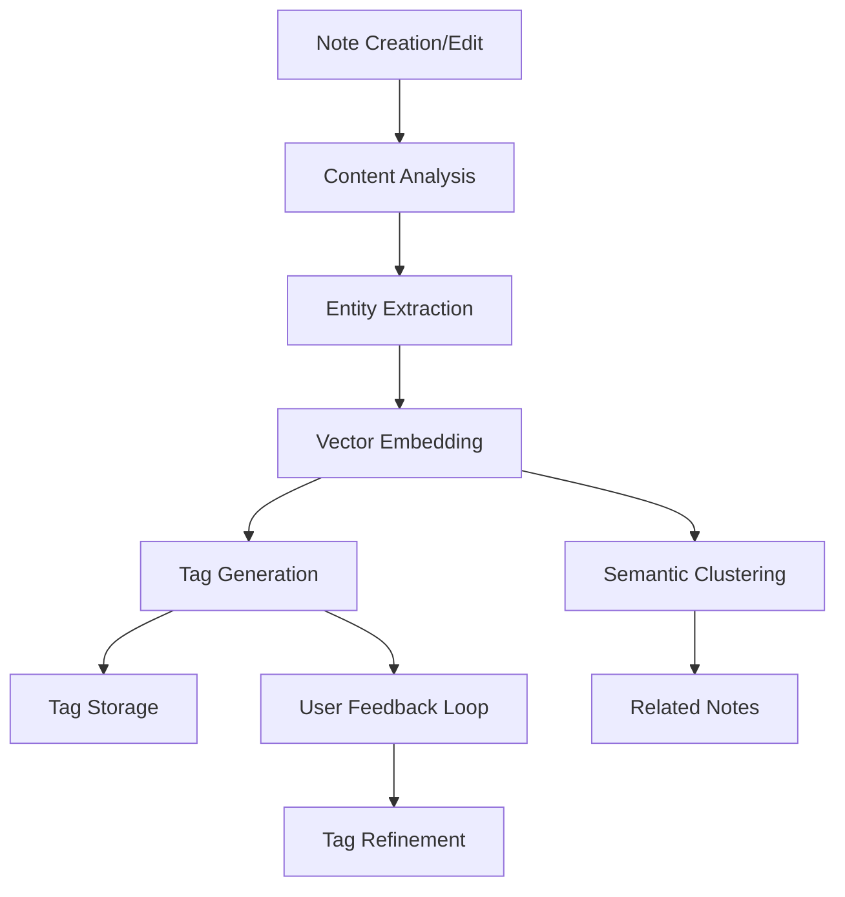

# AI-Driven Note Tagging Implementation Guide

This document outlines the technical approach for implementing AI-driven tagging and organization for notes in the BizzyPerson platform.

## Overview

The AI-driven note tagging system leverages AnythingLLM's vectorization and embedding capabilities to automatically analyze note content, extract meaningful entities, suggest relevant tags, and organize notes semantically.

## Architecture

## Implementation Details

### 1. Entity Extraction

The `EntityExtractor` class analyzes note content to identify agriculture-specific entities and suggests them as tags. It includes:

- Categorized agricultural entity detection (crops, livestock, equipment, etc.)
- Pattern matching for measurements, dates, and financial indicators
- Context-aware categorization (adding parent categories along with specific items)

### 2. Vector Service

The `VectorService` interfaces with AnythingLLM's vectorization capabilities to:

- Convert notes to document format suitable for embedding
- Include metadata for richer semantic understanding 
- Track vector IDs for note retrieval
- Enable similarity searching between notes

### 3. Tag Recommender

The `TagRecommender` integrates entity extraction and vector similarity to:

- Extract entities from note content
- Find similar notes based on vector embeddings 
- Combine both approaches for comprehensive tag suggestions
- Apply relevance scoring based on frequency and position
- Collect user feedback to improve suggestions over time

### 4. User Interface Integration

The `AITagSuggestions` component provides an intuitive UI for:

- Displaying AI-suggested tags to users during note editing
- Showing/hiding suggestions based on content length
- Automatically refreshing suggestions when content changes substantially
- Recording user feedback when tags are accepted
- Managing suggestion state and interactions

## Data Flow

1. When a note is created or edited, its content is analyzed
2. Entities are extracted from the text
3. The note is converted to a vector format and embedded
4. Similar notes are identified based on vector similarity
5. Tags from entity extraction and similar notes are combined
6. Tags are ranked by relevance and presented to the user
7. User feedback is recorded to improve future suggestions

## Implementation Status

The implementation includes:

- ✅ Entity extraction with agricultural focus
- ✅ Note vectorization service (mock implementation)
- ✅ Tag recommendation combining both approaches
- ✅ User interface for tag suggestions
- ✅ Feedback loop for accepted tags
- ⚠️ Integration with AnythingLLM's production vectorization API (requires connection to running instance)

## Next Steps

1. Complete integration with AnythingLLM's vectorization API
2. Implement semantic clustering for better related note discovery
3. Build visualization tools for note relationships
4. Add support for multilingual notes and tag translation
5. Enhance agricultural entity recognition with specialized models

## References

- [AnythingLLM Document Processing Integration](../anythingllm/document-processing-integration.js)
- [Entity Extraction Documentation](../core/notes/services/entityExtractor.ts)
- [Vector Service Implementation](../core/notes/services/vectorService.ts)
- [Tag Recommender Service](../core/notes/services/tagRecommender.ts) 