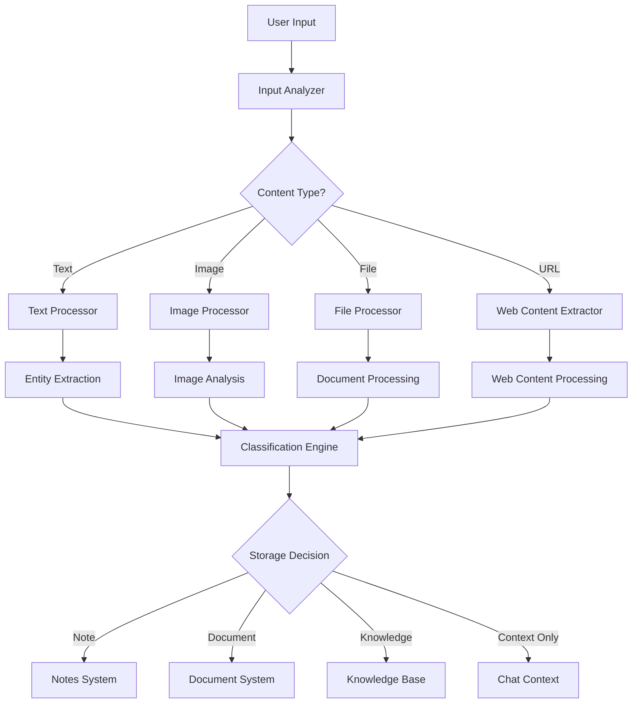

# Unified Content Capture System

## Overview

The Unified Content Capture System provides a seamless approach for capturing and processing information across the BizzyPerson platform. Rather than forcing users to decide where content belongs before entering it, this system allows natural input through any interface and intelligently routes content to the appropriate subsystem.

## Core Concepts

### 1. Interface-Agnostic Capture

Users can input information through any interface:
- Chat conversations
- Direct note creation
- Document upload
- Mobile capture (voice, image)
- URL/web content capture

The system processes content consistently regardless of entry point.

### 2. Intelligent Content Classification

Content is automatically classified based on:
- Content type (text, image, file)
- Content length and structure
- Semantic understanding of content
- User context and history

### 3. Appropriate Content Routing

Based on classification, content is routed to:
- Notes system (for brief observations, thoughts)
- Document system (for structured content, files)
- Knowledge base (for reference material)
- Chat context (for conversational information)

## Chat-Driven Capture Flow

The chat interface serves as a primary entry point for all content:

1. **User Input**: User provides information through natural conversation
2. **Intent Recognition**: System recognizes if information should be stored
3. **Classification**: Content is classified by type and purpose
4. **Storage Suggestion**: System suggests appropriate storage (with UI indicator)
5. **Confirmation**: User confirms or modifies suggestion
6. **Processing**: Content is processed and stored appropriately
7. **Acknowledgment**: System confirms storage and provides access

## Technical Implementation

### Content Processing Pipeline

### Key Components

#### 1. Unified Input Handler

Processes input from any source and normalizes it for the pipeline:
- Chat messages
- Note editor content
- File uploads
- Voice transcriptions
- Image captures
- URL content

#### 2. Content Analyzer

Examines content to determine:
- Content type and format
- Length and complexity
- Entities and key concepts
- Relation to existing information

#### 3. Storage Router

Determines the appropriate storage destination:
- Notes system for brief, personal observations
- Document system for structured content
- Knowledge base for reference material
- Chat context for conversational information

#### 4. Feedback Loop

Learns from user behavior:
- Records user corrections to routing decisions
- Improves classification based on feedback
- Adapts to user preferences over time

## UI Considerations

### Visual Indicators

Clear visual indications for:
- Content that has been stored (and where)
- Content that is being processed
- Content that requires user decision

### Seamless Transitions

Enable smooth transitions between:
- Chat and stored notes
- Notes and related conversations
- Documents and discussion about them

### Cross-System References

Create bidirectional links between:
- Chat messages and stored content
- Notes and related documents
- Different pieces of related information

## Use Cases

### Personal Note Taking

**Example**: Garden observation
- User speaks into chat: "My tomatoes are starting to bloom, but I'm seeing some aphids"
- System recognizes this as a note and suggests storing it
- System extracts entities: tomatoes, bloom, aphids
- Note is created with appropriate tags and references
- Chat continues with suggestions for dealing with aphids

### Document Processing

**Example**: Recipe capture
- User shares URL of recipe
- System extracts recipe content (ingredients, steps)
- Suggests storing as a document
- Processes and structures the recipe information
- Makes it available in knowledge base
- Chat can now reference this recipe in future conversations

### Multi-Modal Capture

**Example**: Equipment issue
- User shares a photo of equipment problem
- Adds voice description: "Tractor hydraulic line leaking at this connection"
- System processes both image and transcribed text
- Creates a note with image and text
- Tags with equipment type and issue category
- Makes available for future reference

## Implementation Phases

### Phase 1: Basic Integration

- Update chat interface to recognize storable content
- Implement simple routing between chat and notes
- Create visual indicators for stored content

### Phase 2: Enhanced Intelligence

- Add sophisticated content classification
- Implement multi-modal processing
- Create bidirectional references between systems

### Phase 3: Adaptive Learning

- Build feedback mechanisms for routing decisions
- Implement personalized routing based on user patterns
- Create advanced relationship mapping between content

## Integration Points

### AnythingLLM Integration

- Leverage vectorization for content classification
- Use semantic understanding for routing decisions
- Implement content reference mechanisms

### LibreChat Integration

- Extend chat capabilities to handle content routing
- Implement visual indicators for content status
- Create seamless transitions between chat and stored content

## Success Metrics

- Reduction in user decision time for information capture
- Increased content capture frequency
- Improved content organization accuracy
- User satisfaction with automatic organization
- Reduced need for manual content reorganization 