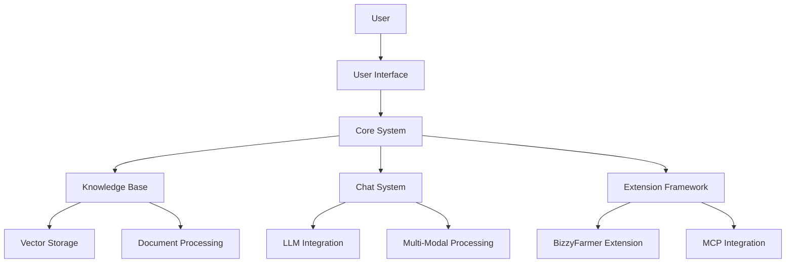
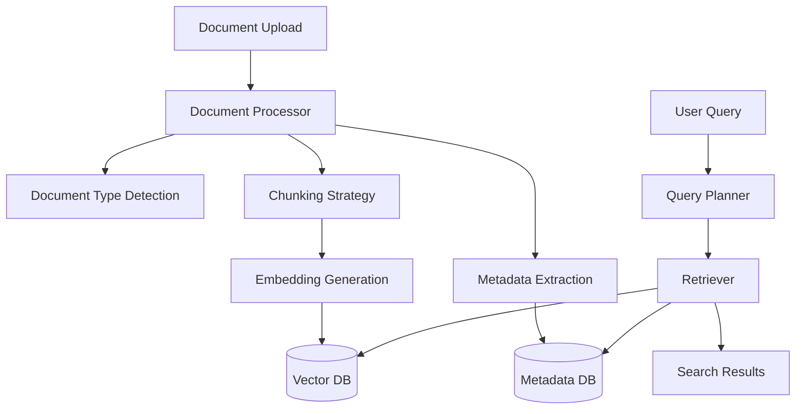
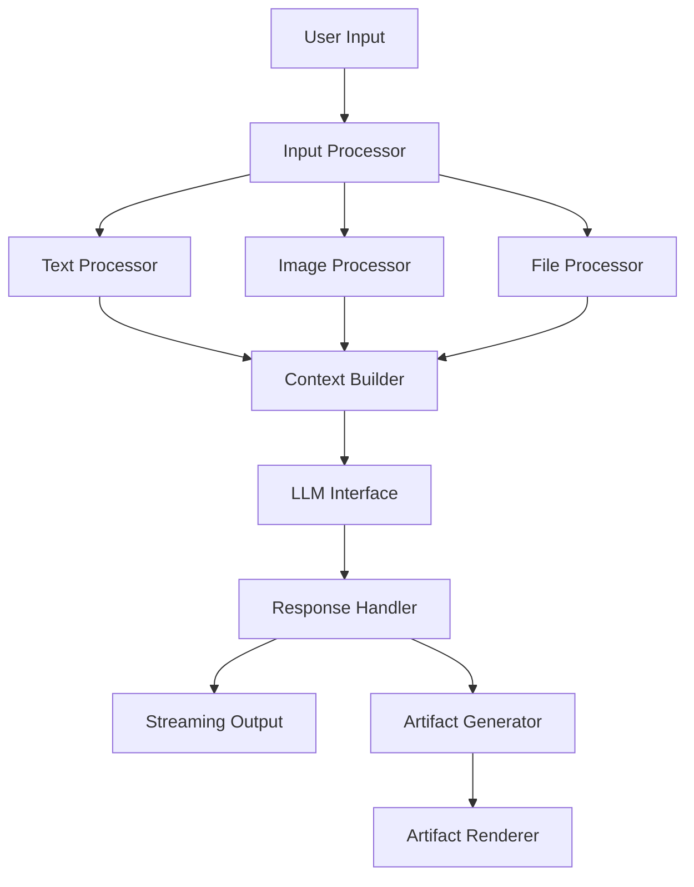
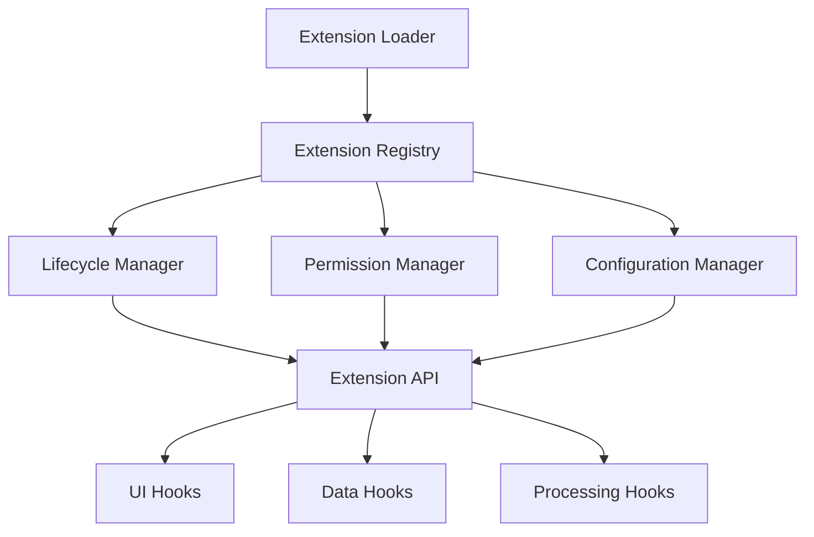
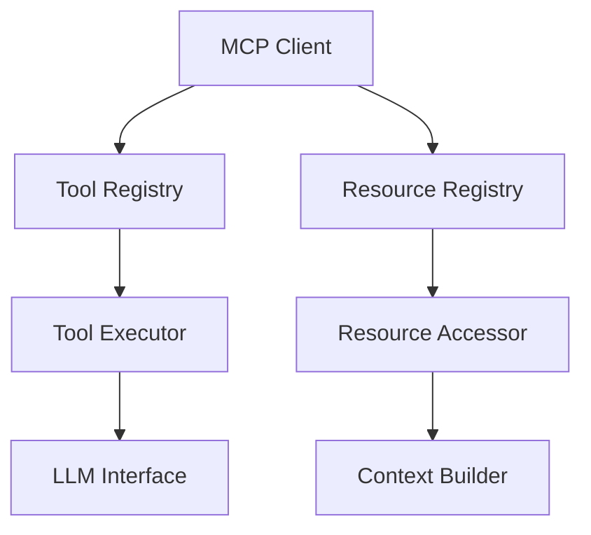

# Custom App Architecture

This document outlines the technical architecture for the custom app that combines features from AnythingLLM and LibreChat.

## System Overview

The custom app follows a modular, feature-based architecture that prioritizes maintainability, extensibility, and performance. It combines the knowledge management capabilities of AnythingLLM with the advanced chat features of LibreChat into a unified system.

## Core Components

### 1. Knowledge Base System

The knowledge base system handles document processing, storage, and retrieval.

#### Key Components:

- **Document Processor**: Handles the ingestion pipeline for documents
- **Document Type Detection**: Identifies document types and applies appropriate processing
- **Chunking Strategy**: Implements intelligent document chunking for optimal retrieval
- **Metadata Extraction**: Extracts and stores document metadata
- **Embedding Generation**: Creates vector embeddings for document chunks
- **Vector Database**: Stores and indexes document embeddings
- **Query Planner**: Optimizes retrieval based on query type
- **Retriever**: Combines vector search with metadata filtering

### 2. Chat System

The chat system manages conversations, LLM interactions, and multi-modal processing.

#### Key Components:

- **Input Processor**: Handles different types of user input
- **Context Builder**: Assembles context for LLM from various sources
- **LLM Interface**: Manages communication with language models
- **Response Handler**: Processes LLM responses
- **Streaming Output**: Implements streaming for real-time responses
- **Artifact Generator**: Creates rich artifacts from LLM responses
- **Artifact Renderer**: Renders artifacts in the UI

### 3. Extension Framework

The extension framework enables the system to be extended with domain-specific functionality.

#### Key Components:

- **Extension Loader**: Discovers and loads extensions
- **Extension Registry**: Maintains registry of available extensions
- **Lifecycle Manager**: Manages extension lifecycle (install, enable, disable, uninstall)
- **Permission Manager**: Handles extension permissions
- **Configuration Manager**: Manages extension configuration
- **Extension API**: Provides interfaces for extensions to interact with the system
- **UI Hooks**: Allow extensions to modify the UI
- **Data Hooks**: Enable extensions to access and modify data
- **Processing Hooks**: Let extensions add custom processing logic

### 4. MCP Integration

The Model Context Protocol integration enables specialized tools and resources.

#### Key Components:

- **MCP Client**: Communicates with MCP servers
- **Tool Registry**: Maintains registry of available tools
- **Resource Registry**: Maintains registry of available resources
- **Tool Executor**: Executes tools and processes results
- **Resource Accessor**: Accesses resources and formats them for use

## Data Flow

### Document Processing Flow

1. User uploads document
2. Document processor identifies document type
3. Document is chunked according to appropriate strategy
4. Metadata is extracted from document
5. Chunks are embedded and stored in vector database
6. Metadata is stored in metadata database

### Chat Flow

1. User sends message (text, image, or file)
2. Input processor handles the input based on type
3. Context builder assembles context from knowledge base and conversation history
4. LLM interface sends prompt to language model
5. Response handler processes streaming response
6. Artifact generator creates artifacts if needed
7. UI renders response and artifacts

### Extension Flow

1. Extension loader discovers and loads extensions
2. Extension registry registers extension capabilities
3. Lifecycle manager initializes extension
4. Extension hooks into system through Extension API
5. System invokes extension hooks at appropriate points

## Technical Stack

### Frontend
- **Framework**: React with TypeScript
- **State Management**: Zustand
- **UI Components**: Custom component library with Tailwind CSS
- **Data Fetching**: React Query

### Backend
- **API Layer**: Fastify
- **ORM**: Prisma
- **Vector Database**: LanceDB
- **Metadata Database**: Supabase PostgreSQL
- **Authentication**: Supabase Auth
- **Document Processing**: Custom pipeline
- **LLM Integration**: OpenAI API, Anthropic API, local models

### Infrastructure
- **Containerization**: Docker
- **Development**: Vite
- **Testing**: Vitest, React Testing Library
- **CI/CD**: GitHub Actions

## Security Considerations

- **Authentication**: JWT-based authentication
- **Authorization**: Role-based access control
- **Data Protection**: Encryption at rest for sensitive data
- **API Security**: Rate limiting, input validation
- **Extension Security**: Sandboxed execution, permission system

## Performance Considerations

- **Caching**: Aggressive caching of embeddings and retrieval results
- **Lazy Loading**: Load components and data only when needed
- **Optimistic Updates**: Update UI before server confirmation
- **Pagination**: Paginate large result sets
- **Background Processing**: Handle document processing in background

## Scalability Considerations

- **Horizontal Scaling**: Stateless design for API layer
- **Database Scaling**: Separate vector and metadata databases
- **Caching Layer**: Redis for shared caching
- **Queue System**: Background job processing for document ingestion
